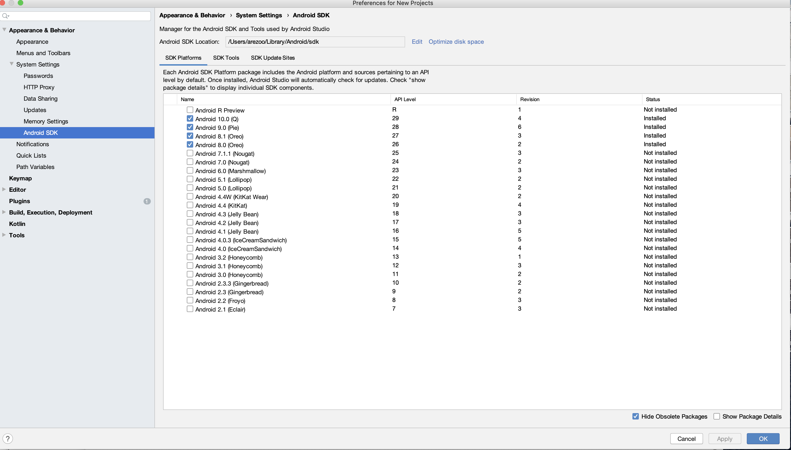
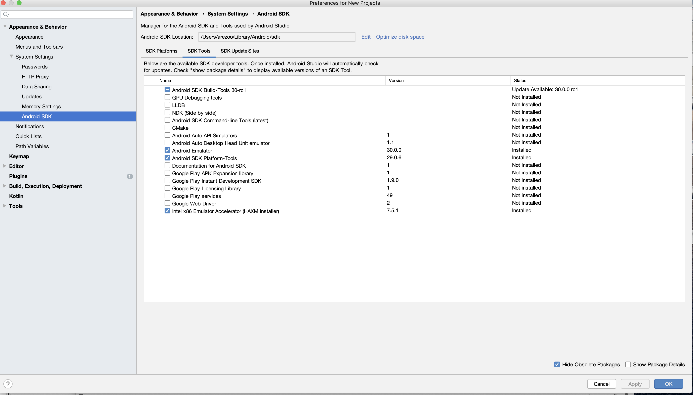

<h1 align="center">
  <a href="https://github.com/hicsail/noise-score/"></a>
  <br>
  <br>
  NOISE-SCORE
  <br>
  <br>
</h1>

## Noise tracking mobile app to help individuals identify noise pollution in their area

The NoiseScore application utilizes smart phone technology to capture both the objective and subjective nature of the sounds you encounter as you go about your daily routine. 

[description of application]

## Getting Started

These instructions will get you a copy of the project up and running on your local machine for development and testing purposes in a mobile emulator instance of your choice of platform.

## Setting up your environment

## Built With

The frontend was built primarily with the [React Native](https://facebook.github.io/react-native/) framework.
  * React
  * JavaScript

The backend was built primarily with SAIL's in-house backend, [Anchor](https://github.com/hicsail/anchor).
  * Node.js
  * hapi.js
  * MongoDBz


### Prerequisites

If you are new to Java, React Native, Node.js, or MongoDB, please first:

* Download and install Java from https://www.java.com/ES/download/
* React Native from the [official website](https://facebook.github.io/react-native/)
* Install Node.js from the [official website](https://nodejs.org/), or if you have `homebrew` installed, you can use `brew install node` instead
* Install MongoDB from the [official website](http://www.mongodb.org/downloads)

### Installation and Setup

First, you will need to clone this repo before installing all the `npm` dependencies in both the `server` folder and the project root directory. After that, you will need to run some first-time setup for the server. You can finally get the app up and running properly after creating and running an instance of both the server and client.

You can follow step-by-step instructions for the full process below:

* clone this repo at `https://github.com/hicsail/noise-score.git`

#### Server setup
* `cd` into the folder where the repo is located
* `cd` into the `server` folder and run `npm install`
* prepare your MongoDB instance by first starting `mongod` _without authentication_: `mongod --dbpath "<your_db_path>"` (in a separate terminal window)
* If you want to access and view data collected through the app as an Administrator, run `npm run first-time-setup` to create the Admin user.
* Start the server by running `npm start`

#### React-Native setup (required for running the apps)
* open a separate terminal window and `cd` into the root directory
* if setting up this project for the first time, run `npm install`
* in the same root directory, run `react-native start`
* open a separate terminal window and follow the following steps for either Android or iOS

### Android Run Setup

* Make sure you have Android Studio and Android SDK installed. From the Android Studio SDK Manager, install the following packages as seen in the screenshots below. You will have to accept the license agreement before the installation takes place.

<h1 align="center">
  <a href="https://github.com/hicsail/noise-score/"></a>
  <br>
  <br>
  Platform Tools
  <br>
  <br>
</h1>

<h1 align="center">
  <a href="https://github.com/hicsail/noise-score/"></a>
  <br>
  <br>
  Platform SDK
  <br>
  <br>
</h1>

* Make sure these packages are in your path. These are necessary for various android components to be recognized:

    * (1) `export ANDROID_HOME=/Users/"<your_user_path>"/Library/Android/sdk` 
    * (2) `export PATH=$ANDROID_HOME/platform-tools:$PATH` 
    * (3) `export PATH=$ANDROID_HOME/tools:$PATH`
    
* run `npm run android`
  * Note: you may get an error along the lines of `The SDK directory '/Users/sarahleinicke/Library/Android/sdk' does not exist.` This means that the path specified in the `/android/local.properties` file is not correct. To fix this, replace `sarahleinicke` in the `local.properties` file with `"<your_user_path>"`.

* If you face an issue with npm run android, try the following sequence of commands:
```
npm install --save-dev jetifier
npx jetify
npx react-native run-android
```
If the above gives no error, you should now see Noise Score launched on your virtual device or phone screen.

### iOS Run Setup

* run `npm run ios`
  * Note: you may get an error along the lines of `error Failed to build iOS project. We ran "xcodebuild" command but it exited with error code 65. To debug build logs further, consider building your app with Xcode.app, by opening noisescore.xcodeproj`. To fix this, open `/ios/noisescore.xcodeproj` in Xcode and build the app there.
  * Note: when building the app via Xcode, you may get an error along the lines of `GoogleMaps/GoogleMaps.h' file not found`. To fix this, run `npm i react-native-maps` in the project root directory via terminal and rebuild the app either via Xcode or via `npm run ios`.

# Old instructions


### Requirements
 To run and develop NoiseScore you will need :
    1. Node.js, you can get it from here https://nodejs.org/en/ or install it through a terminal. 
    2. Mongod, you can get it from here https://www.mongodb.com/ or install it through a terminal.
    3. To clone the master branch, in your desired directory using git.
    
Download and start **React Native Debugger** for help debugging.

## Setting Up The Server 
1. cd into the server folder: ```cd server/```

1. Run the first time setup command: 
    
    ```npm run first-time-setup```
    
1. Follow the prompts on the console. Once finished you follow the instructions below. 

    Note: The email and password you set up as the root user is what will be used to view the data in the backend.

## Android 
### Requirements
1. Android Studio
1. Android Virtual Machine
1. MongoDB (running on localhost:27017)

### To start: 
1. From Android Studio, start an emulator. (Tools -> AVD Manager)
1. Cd into the project folder and start Metro Builder:

     ```react-native start``` or ```react-native start --reset-cache```
1. Open a new window and start mongoDB
  
    ```mongod```
1. Open a new window and start the backend 
    
    1. First cd into the server folder ```cd server/```
    
    1. Start the server ```npm start```
1. Open a new window (starting at the root of the project) and start the app
    
    ```npm run android```

The app should now open up in the Android simulator. Check the Metro Bundler tab to check if the app is being deployed.
### Notes
- Remember to change 'localhost' to '10.0.2.2' if you are running android on a local server. 

## iOS 
### Requirements
1. XCode 10+
1. Node JS 
1. MongoDB (running on localhost:27017)

### To start: cd into the project folder: 

1. Start Metro Bundler
    
    ```react-native start``` or ```react-native start --reset-cache```
1. Open a new window and start mongoDB
  
    ```mongod```
1. Open a new window and start the backend 
    
    1. First cd into the server folder ```cd server/```
    
    1. Start the server ```npm start```
1. Open a new window (starting at the root of the project) and start the app
    
    ```npm run ios```


The app should now open up in the iOS simulator. Check the Metro Bundler tab to check if the app is being deployed. 

## Managing the Anchor Server Installation on AWS

* Login using the IAM link, username and password present in BU SAIL KeePass to be able to see the instance state and edit security groups etc. None of these have been provided here because of security concerns 

* On terminal, SSH using The NoiseScoreKey.pem file found under this projects dropbox folder. Use the following command

  
  ``` ssh - <path to NoiseScoreKey.pem> ec2-user@ec2-3-12-168-21.us-east-2.compute.amazonaws.com```

* Once logged on to server successfully, check server status using 

    ``` pm2 status```
    
* If you wish to restart the server after pulling changes, please run the following command:
  
  ```pm2 start  server.js -o /home/ec2-user/server/server_logs/<output_filename.log> -e home/ec2-user/server/server_logs/<error_filename.log> --time```
  
  More options for forever can be found here: https://pm2.keymetrics.io/docs/usage/quick-start/

* TODO add a line about the S3 backup script once done.

## Debugging
Control D on emulator (Control M on Android) - to set automatic reloads and allow remote debugging.

Download React Native Debugger [here](https://github.com/jhen0409/react-native-debugger) for more options. 


## Notes

1. You will need up update the API Key for the Geolocator under server/.env 
